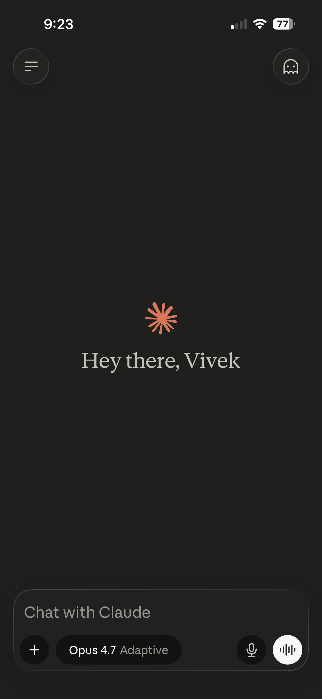
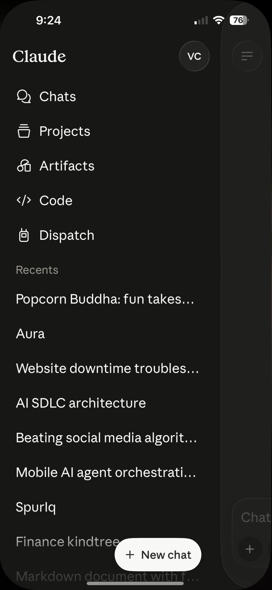
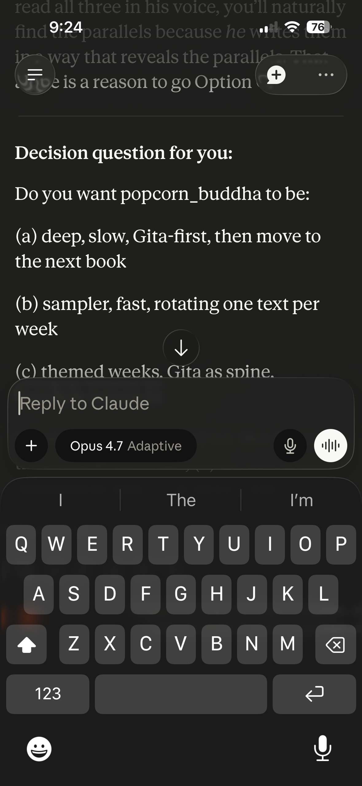

# Design: Happy-path passkey onboarding

## Overview

A first-time TestFlight user opens Aura and reaches the home stub in three taps: language → handle → biometric. No welcome screen, no value-prop, no profile photo. The handle is the only thing the user *types*; everything else is single-tap. Device capability is detected silently; users on non-passkey devices are shown a friendly "not supported in this version" screen (OTP fallback ships in Story 2 once MSG91 lands per OPS-001).

## User flows

### Flow: Happy path (passkey-capable device, ~85–95% of TestFlight cohort)

1. **Entry:** App cold-launch (first time installed). No splash; immediate render of Language Picker.
2. **Language Picker:** User taps either "English" or "हिन्दी". Selection persists immediately; navigate to Handle Entry.
3. **Handle Entry:** User types a handle. Inline validation (live as they type: length, character set). Submit button enabled when validation passes. On submit: tRPC `user.checkHandle(handle)` → if taken, show inline "try another" + clear field; if available, tRPC `user.create(handle, primary_language)` → navigate to Passkey Enrollment.
4. **Passkey Enrollment:** Short single-screen explanation ("This device will remember you with your fingerprint / Face ID. Nothing leaves your phone."), single "Continue" button. On tap: trigger `react-native-passkey` enrollment ceremony → OS-level biometric prompt → on success, `auth.passkey.finishEnrollment` writes the credential row → navigate to Home Stub.
5. **Success state:** Home Stub renders a friendly placeholder ("Welcome, {handle}. Conversations are coming.") so the user knows enrollment worked. Conversations themselves ship in AUR-2.
6. **Failure paths:**
   - Handle collision → inline error, same screen, no nav.
   - Network error during `user.create` or `passkey.finishEnrollment` → retry button, error message points at "Check your connection".
   - User cancels biometric prompt → return to Passkey Enrollment screen with "We couldn't enroll your device — tap to try again."

### Flow: Capability-failed device (no passkey support)

1. **Entry:** Same as happy path (Language Picker).
2. **Language picked → Handle entered → Passkey screen.**
3. **Capability check runs silently** before the biometric prompt. If `react-native-passkey` reports no capability (no biometric hardware, or no Credential Manager on older Android), skip the prompt and navigate to **Not Supported** screen.
4. **Not Supported screen:** Friendly apology + "We're working on a way for your device. Check back next week." No retry; no waitlist UI in this story (would require MSG91 + email collection which are out of scope).
5. **Exit:** User backgrounds the app. No partial user row is written (we don't create a `users` row until passkey enrollment succeeds, per AC8).

## Screens & states

### Screen: Language Picker

| State | Description | Figma frame | Copy needed |
|-------|-------------|-------------|-------------|
| Default | Two large tap-targets ("English" / "हिन्दी"), stacked vertically, centered. Each ≥60% of viewport width, ≥56dp tall (a11y minimum). | TBD | yes — `language.title`, `language.option.en`, `language.option.hi` |
| Loading | N/A — selection is instant (local state). | — | — |
| Error | N/A — no failure mode at this step. | — | — |
| Success | (Selection visual feedback for ~150ms, then nav) | — | — |

### Screen: Handle Entry

| State | Description | Figma frame | Copy needed |
|-------|-------------|-------------|-------------|
| Default | Single-line text input, large; helper text below ("3–32 letters, numbers, or underscore"); "Continue" button disabled until valid. | TBD | yes — `handle.title`, `handle.placeholder`, `handle.helper`, `handle.submit` |
| Loading | "Continue" button shows spinner while `user.checkHandle` is in-flight. | TBD | yes — `handle.checking` |
| Error: invalid characters | Live inline below input; doesn't block typing; helper text turns to error variant. | TBD | yes — `handle.error.invalid_chars`, `handle.error.too_short`, `handle.error.too_long` |
| Error: handle taken | After submit, shown above input as bordered error block; input clears; cursor returns to input. | TBD | yes — `handle.error.taken` |
| Error: network | After submit, shown above input. Retry inline. | TBD | yes — `handle.error.network` |
| Success | (Brief check-mark visual ~150ms, then nav to passkey) | — | — |

### Screen: Passkey Enrollment

| State | Description | Figma frame | Copy needed |
|-------|-------------|-------------|-------------|
| Default | Single-screen explanation (icon + 1-line title + 2-line body) + single "Continue" button. | TBD | yes — `passkey.title`, `passkey.body`, `passkey.submit` |
| OS prompt | Native iOS / Android biometric prompt (system-rendered; not our copy) | N/A — system | — |
| Loading | After OS prompt closes, brief spinner while `passkey.finishEnrollment` POSTs | TBD | yes — `passkey.finalising` |
| Error: cancelled | Returns to default state with inline "We couldn't enroll your device — tap to try again." | TBD | yes — `passkey.error.cancelled` |
| Error: network | Same as cancelled but copy points at connectivity. | TBD | yes — `passkey.error.network` |
| Success | (Brief check-mark visual ~250ms, then nav to home stub) | — | — |

### Screen: Not Supported

| State | Description | Figma frame | Copy needed |
|-------|-------------|-------------|-------------|
| Default | Friendly apology, single illustration, 2-line body, no CTA. | TBD | yes — `unsupported.title`, `unsupported.body` |

### Screen: Home Stub

| State | Description | Figma frame | Copy needed |
|-------|-------------|-------------|-------------|
| Default | Header ("Welcome, {handle}.") + single body line ("Conversations are coming.") + small footer text crediting Aura. No buttons; not interactive in this story. | TBD | yes — `home.welcome`, `home.placeholder`, `home.footer` |

## Interactions

- **Language tile:** tap → 150ms feedback (slight scale-up) → navigate forward. No long-press. Keyboard nav: Tab moves focus; Enter selects.
- **Handle input:** typing → live validation; backspace handled normally. Submit on Enter when valid. No autocomplete from device (`autoComplete="off"`, `autoCorrect={false}`, `autoCapitalize="none"`).
- **"Continue" button (handle screen):** disabled when validation fails; tap → spinner state while checking availability.
- **"Continue" button (passkey screen):** tap → triggers OS biometric prompt.
- **Back gesture:** disabled on all onboarding screens (Android hardware back, iOS swipe-from-left). User can't accidentally cancel mid-flow. (Exception: handle screen back goes to language picker.)

## Accessibility

- **Keyboard flow:** every screen reachable + completable via external keyboard (rare on phones, but matters for accessibility audits).
- **Screen reader:** every interactive element labeled (VoiceOver iOS, TalkBack Android). Language tiles announced as "English, button" / "Hindi, button, हिन्दी".
- **Color contrast:** every text + button pair meets WCAG AA (4.5:1 for normal text, 3:1 for large). No reliance on colour alone for state (error states use icon + colour + text).
- **Reduced motion:** OS `prefers-reduced-motion` honoured — disable the 150ms scale-up + the check-mark animation.
- **Text scaling:** UI respects OS font size up to ~200% without truncation or overlap. Devanagari can require taller line heights than Latin — verify in Hindi rendering.
- **Touch target:** all tap targets ≥44×44 dp (iOS) / ≥48×48 dp (Android).

## Wireframes (ASCII low-fidelity)

Mobile portrait. Single-column. Each screen ~50 chars wide for readability in markdown. Final pixel dimensions resolved in code per `@aura/config/tsconfig/expo.json` defaults + safe-area insets.

### Language Picker (first interactive screen)

```
+----------------------------------------+
|                                        |
|         Choose your language           |
|                                        |
|                                        |
|   +------------------------------+     |
|   |          English             |     |
|   +------------------------------+     |
|                                        |
|   +------------------------------+     |
|   |          हिन्दी                |     |
|   +------------------------------+     |
|                                        |
+----------------------------------------+
```

### Handle Entry — default state

```
+----------------------------------------+
|  ←                                     |
|                                        |
|  Pick a name to use here               |
|                                        |
|  +----------------------------------+  |
|  | e.g. ravi_2026                   |  |
|  +----------------------------------+  |
|  3 to 32 letters, numbers, or _        |
|                                        |
|                                        |
|              +------------+            |
|              |  Continue  | (disabled  |
|              +------------+  until OK) |
+----------------------------------------+
```

### Handle Entry — taken error

```
+----------------------------------------+
|  ←                                     |
|                                        |
|  Pick a name to use here               |
|                                        |
|  ⚠ That one's taken — try another      |
|  +----------------------------------+  |
|  | (cleared, cursor here)           |  |
|  +----------------------------------+  |
|  3 to 32 letters, numbers, or _        |
|                                        |
|              +------------+            |
|              |  Continue  | (disabled) |
|              +------------+            |
+----------------------------------------+
```

### Passkey Enrollment

```
+----------------------------------------+
|                                        |
|                                        |
|              [ 🔐 ]                    |
|                                        |
|   Let this phone remember you          |
|                                        |
|   Your fingerprint or face unlocks     |
|   Aura on this device. Nothing         |
|   personal leaves your phone.          |
|                                        |
|              +------------+            |
|              |  Continue  |            |
|              +------------+            |
|                                        |
+----------------------------------------+

  ↓ on tap

[OS-rendered biometric sheet — iOS Face ID/Touch ID or Android Credential Manager. Not our UI; system handles labels, language, accessibility.]
```

### Not Supported

```
+----------------------------------------+
|                                        |
|                                        |
|              [ 📱⏳ ]                   |
|                                        |
|   This version doesn't work            |
|   on your phone yet                    |
|                                        |
|   We're working on a way in.           |
|   Check back next week.                |
|                                        |
|                                        |
|         (no CTA — honest stop)         |
|                                        |
+----------------------------------------+
```

### Home Stub

```
+----------------------------------------+
|                                        |
|                                        |
|                                        |
|   Welcome, ravi_2026.                  |
|                                        |
|   Conversations are coming.            |
|                                        |
|                                        |
|                                        |
|                                        |
|                                        |
|                                        |
|     Aura — your patient friend.        |
+----------------------------------------+
```

## Visual references — comparable app onboarding flows

### Live references (images in [`./refs/`](./refs/))

Three screenshots of the Claude iOS app (provided by Vivek, 2026-05-24). Files live in [`./refs/`](./refs/); see [`./refs/README.md`](./refs/README.md) for the drop-in instructions if any image links below show as broken.

#### Direct reference for AUR-5: Claude empty / new-chat state



**What to take from this for AUR-5's Home Stub:**
- **Minimal header** — just a sidebar toggle (≡) on the left + a small icon on the right. No app title, no breadcrumb, no menu bar. Aura's Home Stub should match this.
- **Personalised greeting in display position** — "Hey there, Vivek" is roughly mid-screen, large serif type, single line. Aura's Home Stub uses "Welcome, {handle}." in the same position per copy.md.
- **Heavy negative space** — the entire middle is empty. Says "you're at home; nothing's wrong; talk when you're ready." Aura inherits this energy; we have less reason to fill the void than ChatGPT does (no upsell pressure).
- **Brand mark is small and subtle** (the orange sparkle, mid-screen above the greeting). Aura's brand should also stay subtle — the user is here for themselves, not for our logo.
- **What we explicitly do NOT copy:** the bottom input bar. Claude's home is conversation-ready; Aura's Home Stub at AUR-5 stage is not (the conversation surface ships in AUR-2). Instead we render `home.footer` ("Aura — your patient friend.") in the position Claude uses for its input bar. Honest about where we are.

#### Cross-bet reference (for AUR-4 multi-conversation sidebar): Claude sidebar



**What to take for AUR-4 when its time comes:**
- **"Recents" pattern** — vertical list of chat titles, truncated with "…" at length. AUR-4's sidebar pattern is essentially this; titles are auto-summarised per AUR-4 stub brief.
- **Primary nav items above Recents** — Claude has Chats / Projects / Artifacts / Code / Dispatch. Aura at v1 has just Conversations (Recents). We don't need a multi-section nav until much later — keep the sidebar lean.
- **"+ New chat" floating action at the bottom** — clear single primary action. Aura's equivalent: "Start a new conversation" CTA.
- **Brand wordmark + user avatar at top** — for AUR-4 we can match this layout but with "Aura" + the user's handle initial.
- **Not relevant for AUR-5** — there is no sidebar in this story (single Home Stub, no multi-conversation surface yet). Kept in this folder for forward reference.

#### Cross-bet reference (for AUR-2 voice loop): Claude active conversation



**What to take for AUR-2 when its time comes:**
- **Conversation typography** — generous line height, plain body text, no chat-bubble decoration. Reads like a letter, not a message. Matches Aura's reflective voice (per copy.md tone notes).
- **Structured questions can use plain markdown formatting** — Claude's "Decision question for you: (a) ... (b) ... (c) ..." renders as straight text with line breaks. AUR-2's reflective questions can do the same; no need for custom UI primitives.
- **Bottom bar pattern: input + model badge + mic + voice mode button** — direct analog to what AUR-2 needs. The big filled circle for voice mode is the affordance for users who'd rather speak. Aura's voice-first stance means we may invert this: voice mode is the default, text is the alternative.
- **Header stays minimal during conversation** — sidebar (≡) + new chat (+) + more (...). Same three controls Aura's conversation surface should have.
- **Not relevant for AUR-5** — there's no conversation in this story. Kept here for forward reference.

### Web-only references (link-list — no images)

Additional comparables worth ~5 min of browsing each before AUR-5 implementation. No images embedded; click through if you want the visuals.

| Comparable | What to learn | What to avoid |
|------------|---------------|---------------|
| **[Wysa (Indian-origin AI counsel)](https://www.wysa.com/)** | Voice + tone of first-open ("hi, I'm Wysa" framing). Calm color palette. Trust signals in copy. | English-first onboarding (we're vernacular-first); CBT/clinical framing in early screens (we're explicitly not clinical per product § Out of Scope). |
| **[Replika (Western AI companion)](https://replika.ai/)** | Persistent-memory framing on first-open ("I'll remember you"). Lightweight onboarding (no email required for free tier). | Heavy avatar / personality customisation upfront (we skip — Aura is voice-first, no avatar); engagement-maximizing patterns like streaks (anti-engagement per R-PORTFOLIO-3). |
| **[ChatGPT mobile (general AI)](https://chat.openai.com/)** | Get-to-first-conversation speed (≤3 taps after install on iOS). Pure focus on the conversation surface. | Account-required gate (we use passkey, no account); English-first defaults. |
| **[Astrotalk (Indian vernacular consumer)](https://www.astrotalk.com/)** | Indian-vernacular UX patterns at scale (handles 35M MAU). Hindi script rendering across device manufacturers. Indian users' expectations for "service-style" apps. | Per-minute paid call entry (we're free); marketplace-style chooser screens (we're 1:1 with Aura, not a marketplace). |
| **[Tele-MANAS (Indian govt helpline) public materials](https://telemanas.mohfw.gov.in/)** | Crisis-escalation language patterns in Indian vernacular. Trust signals for mental-health-adjacent state-backed services. | Voice-only IVR flow (we're an app); episodic crisis-mode framing (we're ongoing companion). |

## Design system components used

- `Screen` (root container with safe-area padding)
- `Text` (typography primitive, scales with OS settings)
- `Input` (text input)
- `Button` (primary, with loading + disabled states)
- `IconText` (icon + label paired)

New patterns (flagged for review by Architect / future design-system bet):
- **Language Tile** — large tap-area with bilingual label. New pattern; not in any existing app. Consider promoting to design system after AUR-1 ships.
- **Inline validation error block** — different visual treatment than form-field-level errors. Standardise once we have ≥3 examples.

## DRI Log

### Decisions

- [2026-05-24] [Designer] **Skip the welcome / value-prop screen per PM Decision in [AUR-1 brief](../../brief.md).** Language Picker is the first interactive surface.
  - **Rationale (required):** Brief locks this. Value of Aura is the conversation, not the description of it.
  - **Area (required, tag):** design / flow.
  - **Alternatives considered (required):** One-screen splash (rejected — brief explicitly skips it).
  - **Reversibility:** easy.

- [2026-05-24] [Designer] **Disable back gesture on all onboarding screens except handle → language.**
  - **Rationale (required):** Users on the passkey screen who accidentally swipe back lose their handle entry (the handle row is committed only after `user.create`; backing out would leave them re-entering). Disabling back prevents accidental loss. Handle → language is OK to allow because language pick is one tap to redo.
  - **Area (required, tag):** design / interaction.
  - **Alternatives considered (required):** Allow back everywhere (rejected — accidental data loss); allow back with "are you sure" modal (rejected — breaks the friction-less promise).
  - **Reversibility:** easy.

- [2026-05-24] [Designer] **Capability-failed users see a static "Not Supported" screen with no CTA in this story.**
  - **Rationale (required):** OTP fallback ships in Story 2 (depends on MSG91 unblocking from OPS-001). A waitlist email collection would require email infrastructure that isn't in scope. A "no CTA" screen is honest — sets expectation, doesn't pretend.
  - **Area (required, tag):** design / scope.
  - **Alternatives considered (required):** Email waitlist (rejected — out of scope); auto-redirect to a web waitlist (rejected — fragments the UX); silent failure (rejected — confusing).
  - **Reversibility:** easy — replace with OTP-path entry in Story 2.

### Risks

- [2026-05-24] [Designer] **R-DESIGN-1: No real Figma frames in this story.** Spec uses ASCII low-fi wireframes + comparable-app references (added 2026-05-24) instead of Figma. Engineer-led visuals at implementation time.
  - **Likelihood (required):** medium (will produce a less-polished visual than a Figma-driven design would; ASCII wireframes + reference links mitigate some of this).
  - **Impact (required):** low (TestFlight cohort tolerates rough visuals; brand voice is reflective, not aesthetic-led; per user direction 2026-05-24, deferred Figma to AUR-2 where UX matters more).
  - **Mitigation (required):** (1) ASCII wireframes in this doc give engineer + Hindi copy reviewers a visual anchor; (2) Comparable-app reference table flags what to study + what to avoid; (3) Engineer follows `@aura/config` design-system primitives strictly; (4) Visual review as part of PR; (5) If TestFlight feedback flags visual roughness, schedule a polish story before public expansion; (6) Figma MCP authentication deferred to before AUR-2 begins.
  - **Area (required, tag):** design / process.

- [2026-05-24] [Designer] **R-DESIGN-2: Devanagari rendering differs across iOS / Android / device manufacturers.** Hindi text can clip, overflow, or render with wrong glyph fallbacks on cheap Android devices.
  - **Likelihood (required):** medium-high (well-known issue with low-end Android in India).
  - **Impact (required):** medium (Hindi-primary users see broken text → trust break + drop-off).
  - **Mitigation (required):** Engineer tests on at least one Hindi locale on each: iOS (recent), iOS (oldest supported), Android flagship, low-end Android (e.g. Realme / Redmi). Document any rendering issues as story-level Issues for fix in Story 1.5 (a polish story between AUR-5 and AUR-6 if needed).
  - **Area (required, tag):** design / i18n / device-compatibility.

### Issues
_None at design-draft stage._
