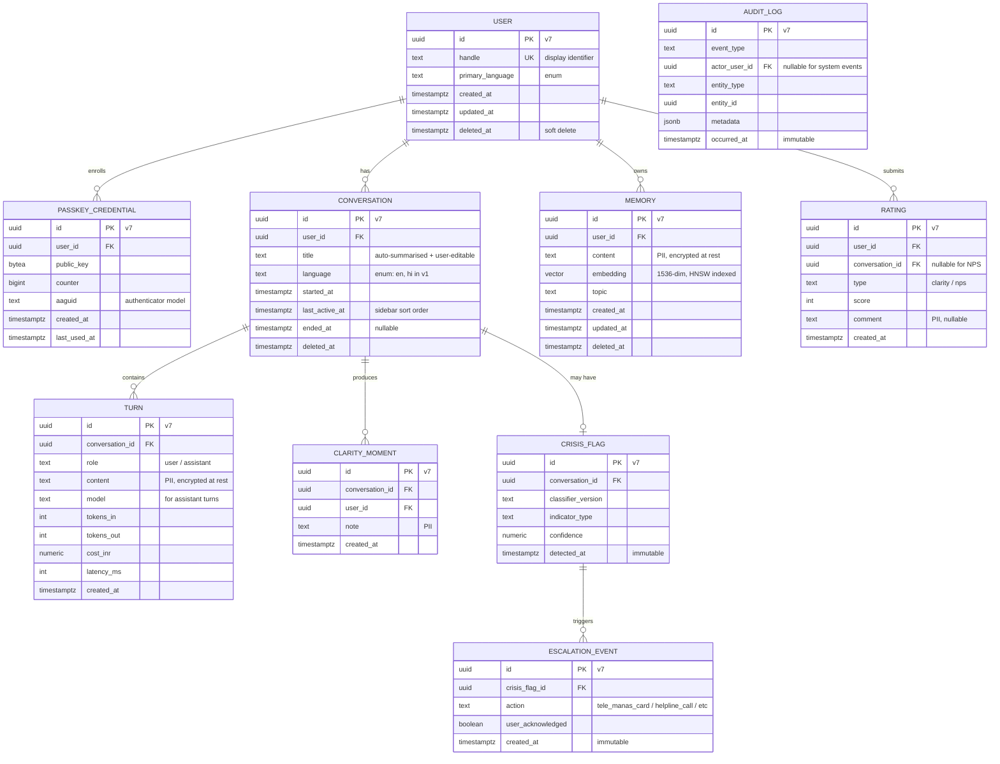

# Foundational Architecture Bet — Aura

> The platform's load-bearing technical decisions, as a wager.

**Inherits from:** [`docs/foundation/product.md`](./product.md) (FOUNDATION-PRODUCT v2, approved 2026-05-24 by Vivek; v1 superseded same day).
**Research basis:** [`docs/foundation/architecture-research.md`](./architecture-research.md). Every per-row citation below points to a § section there; primary URLs live in that doc to keep this artifact scannable.
**Draft history:** two prior drafts rejected (2026-05-23 — missing fitness functions and per-pillar scoring; 2026-05-24 — missing Foundational Data Model section after role/workflow/template update). This is the third draft; both prior drafts were `proposed`, never approved, so no version files were preserved.

## Context

Constraints inherited from the product bet that shape every choice in this document:

1. **Cost guardrail (architectural):** ≤ ₹20 / WAR / month all-in (infra + AI + storage). Per product bet v2, this is the **architectural cost ceiling**, not a user price. User-facing price is **free in v1**; pricing decision deferred to post-100K WAR.
2. **Voice-first vernacular UX** in scope. **v1 launch languages: English + Hindi only**; ramp to product bet's ≥6-by-month-12 follows per-language quality eval (R-SPEECH).
3. **Persistent memory of the user's life story** is the primary moat — memory is a first-class durable system, not a session cache.
4. **DPDPA-aligned, no data sales** (product § Out of Scope). Storage region: India.
5. **Crisis escalation in same session** — synchronous, not async.
6. **Team size: solo → small (≤3)** for the foundation period. Single language, single deploy target, no resume-driven stack.
7. **Q3 OKR persona-validation field work** must run before architecture freezes (product R1). This v1 is built for fast change in the first 90 days.

## Fitness Functions

≥1 per Well-Architected pillar, measurable in numbers. These are this bet's falsification criteria — if any threshold misses at the named scale, the architecture has failed.

| Pillar | Function (measurable) | Threshold | Source / rationale |
|--------|-----------------------|-----------|--------------------|
| **Reliability** | Monthly conversation-turn success rate (turn completes within timeout, returns audible response) | **≥ 99.5% per month at 1,000+ WAR sustained** (allows ~3.6 hr/month degradation) | Derived from product § In scope ("always-on availability") + AI Gateway empirical fallback rescue rate (~3.5%) — see research §2B / §4D |
| **Security** | (a) Data residency: % of user memories stored in India region. (b) Confirmed account-takeover incidents per 10K WAR per quarter. | **(a) 100% India region. (b) ≤ 1 confirmed takeover / 10K WAR / quarter, with recovery actioned within 24 hours.** | Derived from product § Guardrails (zero P0 trust) + DPDPA. Threshold (b) is calibrated against the industry ATO baseline (76% YoY increase in 2024) — see research §4A |
| **Performance efficiency** | (a) Conversation-turn P95 latency (mic-open → first TTS audio chunk). (b) Memory recall P95 latency. (c) Concurrent-WAR ceiling. | **(a) P95 ≤ 3.5s end-to-end. (b) P95 ≤ 1.5s. (c) Supports 5,000 concurrent WAR at peak (assumes ~5% concurrency at 100K WAR target).** | Derived from voice-UX expectation; pgvector benchmark (P95 65ms over REST at 10M vectors) provides ≥15× headroom — see research §2A |
| **Cost optimization** | All-in cost per WAR per month (Vercel + Supabase + AI Gateway + EAS + Bhashini + MSG91 OTP fallback) | **≤ ₹20 / WAR / month at 1,000+ WAR sustained.** Year-1 infra budget ceiling: ₹20 × 100,000 WAR × 12 mo = **₹2.4 crore** (worst case at year-end WAR target). | Direct from product v2 § Guardrails — non-negotiable in the free-in-v1 model since there's no revenue to absorb a miss |
| **Operational excellence** | (a) Deploy frequency. (b) MTTR for production incidents. (c) Sustained ops burden. | **(a) Daily on-demand deploys via Vercel previews + EAS Update. (b) MTTR < 30 min critical / < 2 hr non-critical. (c) Sustained ops ≤ 2 hrs/week.** | Derived from team size (solo → 3) + 1-week sprint cadence + Q3 OKR KR2 ("first feature bet brief approved") |
| **Sustainability** | Hosting region constraint + carbon-per-request budget | **100% user data in India region (Vercel `bom1` + Supabase `ap-south-1`). Carbon-per-request budget: not load-bearing at < 100K WAR — revisit when WAR > 100K or when carbon-aware Vercel SLAs publish.** | DPDPA + brand trust make region pin structural. Honestly deferred for carbon: an emotional-counsel product at < 100K WAR has carbon impact dominated by user device usage, not server fleet. |

## Decision

A **TypeScript monorepo (Turborepo + pnpm) on Vercel + Supabase**, with **Expo / React Native** as the user-facing mobile app and **Next.js 16 App Router** as the web (marketing + admin + API routes + AI orchestration). Identity is **passkey-primary (WebAuthn synced) gated by device biometric**, with a display handle (human-readable, not a credential) and **SMS OTP via MSG91** as recovery / device-capability fallback. The AI layer routes through **Vercel AI Gateway** to **Anthropic Claude** and **OpenAI** models — selectable per turn-criticality, with automatic fallback. **Bhashini / AI4Bharat** handles vernacular ASR/TTS. The user's life story lives in **Postgres + pgvector inside Supabase**, region-pinned to India (`ap-south-1`). The data model (next section) is **derived from product bet v2 — no invented entities**; the DB choice is informed by that derivation. Cron jobs run on Vercel Cron, owned by the Enterprise/Solution Architect per `compass/config.yaml`. **User-facing price is free in v1 per product bet v2; architectural cost ceiling (≤₹20/WAR/mo) is now the sole cost discipline.**

## Foundational Data Model

Conventions every bet inherits. Decided **before** the DB choice — the DB row in the Stack table below cites this section. No invented entities — every entity traces back to a specific line in [`docs/foundation/product.md`](./product.md).

### Core entities

| Entity | Purpose | Traces back to (product bet line / quote) |
|--------|---------|-------------------------------------------|
| **User** | Identity holder; container for memories and conversations | "underserved Indians" (Vision); three personas in § Target users / personas |
| **PasskeyCredential** | Per-device WebAuthn public-key credential + counter | Architecture auth decision (passkey-primary); inherits from product § Guardrails ("zero P0 trust incidents") |
| **Conversation** | A persistent topical thread the user returns to over time (sidebar item in the mobile UI). A user has many Conversations in parallel ("career decision", "mum's surgery", "money planning"); each accumulates Turns over multiple sittings. Has `title` (auto-summarised after first ~3 turns, user-editable) and `last_active_at` (sidebar sort order). | "completed ≥1 reflection session... ended explicitly or produced a saved 'clarity moment'" — the North-star metric definition uses "single conversation" to mean a single topical thread, consistent with ChatGPT / Claude / WhatsApp product norms |
| **Turn** | Single exchange (user message + assistant response) within a Conversation | "≥3 meaningful turns in a single conversation" — North-star metric definition |
| **Memory** | A semantically-indexed piece of the user's life story | "Persistent memory of the user's life story" — § Defensibility / Moat (primary moat #1) |
| **ClarityMoment** | User-saved or system-recognised clarity event | "produced a saved 'clarity moment'" — North-star metric definition |
| **CrisisFlag** | Conversation-level flag indicating crisis content detected by the same-turn classifier | "≥ 99% of conversations flagged for crisis indicators... receive a Tele-MANAS / domain-appropriate escalation within the same session" — § Guardrails (Safety) |
| **EscalationEvent** | A specific escalation action taken in response to a CrisisFlag (e.g. showed Tele-MANAS card) | Same Safety guardrail |
| **Rating** | Post-session clarity score (1–5) and NPS submissions | "≥ 1,000 post-session ratings" (Objective 1 KR3); "NPS ≥ 40" (Objective 2 KR1) |
| **AuditLog** | Immutable log of safety-relevant and compliance-relevant events (crisis flags, escalations, user-initiated erasures, prompt-version changes, key rotations) | "Zero P0 trust incidents" (Guardrails) + DPDPA implicit (right-to-erasure evidence) |

**Considered and deliberately excluded** (would be invented, not derivable from product v2):
- *Decision / advice* entity — vision explicitly says Aura asks, doesn't decide. We don't track user decisions.
- *Subscription / Payment* entity — out of scope in v1 per product § Out of Scope ("Ad-supported in v1", free at user level).
- *Friend / Connection* entity — not a social product; product bet describes 1:1 counsel.
- *Notification / Reminder* entity — push notifications not in v1 scope.
- *Pattern / Aggregate insight* entity — corpus-level aggregation work is future architectural-initiative scope.

`Language` is a column on `User` (primary) and `Conversation` (selected for this thread), not a separate entity — small fixed enum. **v1 launch: `'en'` and `'hi'` only** (English + Hindi). Ramp plan (per product § In scope: "≥6 Indian languages by month 12"): add `'ta'`, `'te'`, `'bn'`, `'mr'`, `'kn'` after passing per-language quality eval (per R-SPEECH). The enum is forward-compatible (additive migration).
`Handle` is a column on `User`, not a separate entity — it's a display string with a uniqueness constraint, not a credential.

**Sessions vs Conversations — how WAR is computed.** A *Session* is a computed concept (not a stored entity): a continuous sitting within a Conversation, detected by clustering `turn.created_at` timestamps with a gap threshold (e.g. >30 min idle = new session). A *Reflection Session* (the WAR-qualifying event per the product bet's north-star definition) = a Session in any Conversation that produced ≥3 Turns AND (was ended explicitly by the user OR produced a saved `ClarityMoment`). WAR is computed in the analytics layer over `turns` joined with `clarity_moments`; no separate Session table is materialised because (a) gap-thresholds drift over time without breaking history when computed live, and (b) it keeps the schema thin.

### Identity strategy

**UUID v7** for all primary keys.

- Sortable (time-ordered → index locality for inserts; pages cache-friendly under append-heavy workloads like turns + memories).
- Externally safe (no enumeration; safe to expose in URLs / tRPC payloads to mobile).
- Standardised (IETF RFC 9562 since 2024) — available via Postgres extensions and in-app generation.
- Alternative considered: **ULID** — same property set, smaller ecosystem in 2026; rejected in favour of the standard.
- Alternative considered: **bigint sequential** — rejected (enumeration risk for User and Memory ids exposed to mobile client).

### Tenancy model

**Single-tenant per user on shared infrastructure**, enforced via Postgres Row-Level Security (RLS).

- Derived from product bet v2 personas (B2C only) and from § Out of Scope ("B2B (this version). No EAP, no university partnerships, no white-label").
- Every user-owned row carries `user_id`; RLS policies pin reads/writes to the authenticated user (or service role for cron/admin paths).
- The data-as-moat reconciliation: aggregate analysis on the vernacular conversation corpus (primary moat #2) is performed **only on opt-in basis on anonymised embeddings**, never on raw memory content. Single-tenant data model is preserved; corpus moat work runs in a separate ETL path.

### Audit / event-sourcing posture

**Selective audit log via dedicated `audit_log` table, not full event sourcing.**

- Full event sourcing is overkill for CRUD-shaped data and adds operational burden incompatible with the Op-ex fitness function (sustained ops ≤ 2 hrs/week).
- The `audit_log` table captures these event classes immutably:
  - `crisis.flag_raised` and `crisis.escalation_triggered` — required by Safety guardrail (≥99% same-session escalation evidence).
  - `user.erasure_requested` and `user.erasure_completed` — required by DPDPA (right-to-erasure auditability).
  - `prompt.version_changed` — required by safety / quality review (prompts are versioned in `packages/ai/prompts/`).
  - `key.rotated` — security hygiene.
- Regular CRUD entities (User, Conversation, Memory, ClarityMoment, Rating) keep `created_at` / `updated_at` columns only.

### Delete posture

| Entity | Delete behaviour |
|--------|------------------|
| User | Soft delete with 30-day restore window; hard delete on user-initiated DPDPA erasure after 30-day window (cascades to all user-owned data). |
| Memory | Soft delete with 30-day restore; hard delete on DPDPA erasure or 30-day expiry. |
| Conversation, Turn, ClarityMoment, Rating | Soft delete (cascade from User soft delete); hard delete on DPDPA erasure. |
| PasskeyCredential | Hard delete only (user-initiated device removal — no benefit to soft-delete a credential). |
| CrisisFlag, EscalationEvent | **Immutable.** Required for safety review and regulatory evidence. Not deleted even on user erasure — the *content* of the flag (the conversation that triggered it) is purged, but the flag fact + escalation action are retained anonymously. |
| AuditLog | **Immutable.** Append-only by design. |

Retention: 24-month inactivity prompts re-engagement; if no response after a documented escalation, automated soft-delete → hard-delete cycle.

### PII / sensitive-data handling

- **Everything user-generated is PII at the highest sensitivity level.** Conversation content, memories, clarity moments, and ratings all contain life-story content.
- **Encryption at rest:** Supabase Postgres standard AES-256 at rest. Envelope encryption with per-user data keys (Variant C from the 2026-05-24 memory discussion) is **deferred** — preserved as a future architectural-initiative bet if the Security pillar needs to move from `good` to `best`.
- **Schema annotation:** PII columns marked with `-- @pii` comment convention; logging layer scrubs flagged columns (already covered in Cross-cutting standards § Logging).
- **Logging:** never log `Turn.content`, `Memory.content`, `ClarityMoment.note`, or `Rating.comment`. Log token counts, latency, model, and `handle_hash` instead (already in Cross-cutting standards).
- **Region:** India only (`ap-south-1`) — enforced at infrastructure level by the Security fitness function (data residency 100%).
- **Retention windows above** apply per § Delete posture.

### Timestamps convention

- All timestamp columns are `timestamptz`, stored UTC.
- `created_at timestamptz NOT NULL DEFAULT now()` on every entity.
- `updated_at timestamptz NOT NULL DEFAULT now()` on mutable entities (User, Memory, Conversation); maintained by app or trigger.
- `deleted_at timestamptz NULL` on soft-deletable entities.
- Display-time conversion to user locale happens in the mobile / web client, never in the DB.

### Migration strategy

**Online expand-contract.**

- Online (zero downtime) — required by Reliability fitness function (≥99.5% turn success; no planned maintenance windows eating into the 3.6 hr/month degradation budget).
- Expand-contract pattern for breaking changes: (1) add nullable column, (2) deploy app reading old + writing both, (3) backfill, (4) deploy app reading new, (5) drop old column.
- Daily deploy cadence (Op-ex fitness function) requires migrations cannot block deploys → expand-contract by default.
- All migrations are numbered SQL files in `packages/db/src/schema/`, applied via Supabase CLI in CI.

### High-level ERD



## Stack

**The Database row below cites the Foundational Data Model section above** — Supabase + pgvector was chosen *because* the derived data model fits its shape (relational entities with a high-cardinality vector-indexed Memory entity, RLS-enforced single-tenancy, append-heavy Turn/AuditLog, expand-contract migrations).

| Concern | Choice | Reversibility |
|---------|--------|---------------|
| Repo shape | Turborepo + pnpm workspaces monorepo | medium |
| Backend language | TypeScript / Node.js 24 LTS | hard |
| Backend framework | Next.js 16 App Router (route handlers + server actions) | medium |
| Frontend (web/admin) | Next.js 16 App Router | medium |
| Mobile framework | Expo SDK 52+ (React Native, EAS Build, EAS Update OTA) | medium |
| Database | Supabase (managed Postgres 16 + pgvector + Storage), region `ap-south-1`. **Choice grounded in § Foundational Data Model.** | medium (DB layer); hard (pgvector at scale) |
| Memory layer (the moat) | Postgres `memories` table + pgvector HNSW index (per § Foundational Data Model) | hard |
| Contracts | tRPC for mobile↔server; Server Actions for web↔server | medium |
| Auth / identity | **Passkey-primary (WebAuthn synced), gated by device biometric.** Display handle (human-readable identifier, not credential). SMS OTP via MSG91 as recovery / device-capability fallback. Private key never leaves device. | medium |
| AI orchestration | Vercel AI Gateway → Anthropic Claude (Sonnet / Haiku) + OpenAI (GPT-4o / 4o-mini), per-turn routing | easy (Gateway boundary) |
| Speech (ASR / TTS) | Bhashini / AI4Bharat (IndicASR / IndicTTS); Sarvam fallback wired at module boundary | easy |
| Deployment target | Vercel (web + API, region `bom1`) + EAS (mobile builds) + Supabase Cloud | one-way for already-stored India-region data |
| CI/CD platform | GitHub Actions (lint/test/typecheck) + Vercel preview deployments + EAS preview channels | medium |
| Observability | Sentry (errors, mobile crashes) + Vercel Observability (RUM + functions) + AI Gateway spend/uptime dashboard | medium |
| Secrets management | Vercel env vars (web/API) + EAS Secrets (mobile) + Supabase project secrets | hard |
| Infrastructure-as-code | **Deferred.** Revisit when ops scope > 1 hr/week or 2nd non-prod env required | easy |
| Cron / scheduled work | Vercel Cron, owned by Enterprise/Solution Architect | medium |

### Per-row pillar evaluation + research citations

Each row scored on all 6 Well-Architected pillars. Score: good / acceptable / poor. Rationale tight; full research basis in [`architecture-research.md`](./architecture-research.md) at the cited section. The Database and Memory layer rows additionally cite the **Foundational Data Model** section above.

#### Repo shape: Turborepo + pnpm monorepo

| Pillar | Score | Rationale | Research citation |
|--------|-------|-----------|-------------------|
| Reliability | good | Shared CI gates catch cross-package regressions before deploy | research §1C |
| Security | good | One dependency surface to audit; Renovate covers all packages from one config | research §3A |
| Performance efficiency | good | Turbo cache → fast CI; pnpm hoisting avoids `node_modules` bloat | research §1C |
| Cost optimization | good | One CI bill; cached builds reduce CI minutes | research §1C |
| Operational excellence | good | Single repo for solo / small team — context-switching cost is near zero | research §1C, §3A |
| Sustainability | acceptable | Single CI footprint; no duplicated build pipelines per package | research §1C |

#### Backend language: TypeScript / Node.js 24 LTS

| Pillar | Score | Rationale | Research citation |
|--------|-------|-----------|-------------------|
| Reliability | good | Node 24 LTS covers entire 24-mo measurement window | research §5A, §3A |
| Security | acceptable | npm audit footprint is operational cost; well-trodden patching | research §3A |
| Performance efficiency | acceptable | Single-threaded acceptable for I/O-bound API + LLM-proxy; not CPU-numerics-heavy | research §5A |
| Cost optimization | good | Vercel Fluid Compute (active CPU billing) matches Node async pattern | research §5A |
| Operational excellence | good | Same language across mobile / web / packages reduces context-switching | research §5A |
| Sustainability | acceptable | Fluid Compute reuses instances → reduced cold-start carbon overhead | research §5A |

#### Backend framework: Next.js 16 App Router

| Pillar | Score | Rationale | Research citation |
|--------|-------|-----------|-------------------|
| Reliability | good | Mature ecosystem; large community = fast detection of regressions | research §3A, §5B |
| Security | good | Framework-level hardening; security advisories well-published | research §5B |
| Performance efficiency | good | Cache Components / PPR; Vercel Mumbai region available | research §2C, §5B |
| Cost optimization | good | Fluid Compute pricing + default 300s timeout removes one cost-spike class | research §5B |
| Operational excellence | good | One-command deploy; preview env per PR; built-in observability | research §5B |
| Sustainability | acceptable | Region pin to Mumbai → no cross-continent traffic; instance reuse via Fluid Compute | research §5B |

#### Frontend (web/admin): Next.js 16 App Router

| Pillar | Score | Rationale | Research citation |
|--------|-------|-----------|-------------------|
| Reliability | good | Same as backend (same framework) | research §3A, §5B |
| Security | good | Same as backend | research §5B |
| Performance efficiency | good | Server Components default → minimal JS on marketing pages | research §5B |
| Cost optimization | good | Static rendering for marketing; Fluid Compute for admin | research §5B |
| Operational excellence | good | One framework to learn; one deploy target | research §5B |
| Sustainability | good | Static-by-default for public pages → minimal compute carbon | research §5B |

#### Mobile framework: Expo SDK 52+ (React Native)

| Pillar | Score | Rationale | Research citation |
|--------|-------|-----------|-------------------|
| Reliability | good | EAS Update enables push-to-fix without app-store review cycle | research §1C, §5C |
| Security | acceptable | Secure storage primitives (expo-secure-store) wrap OS keychain | research §5C |
| Performance efficiency | acceptable | RN audio path mature for voice; matches user-device perf baseline | research §5C |
| Cost optimization | good | One codebase ships iOS + Android | research §1C, §5C |
| Operational excellence | good | EAS Build + Update + Submit cover the entire mobile pipeline | research §1C, §3C |
| Sustainability | acceptable | Single codebase → single CI/CD footprint | research §3C |

#### Database: Supabase (Postgres 16 + pgvector + Storage), `ap-south-1`

**Choice grounded in § Foundational Data Model** — the derived model is relational with a high-cardinality vector-indexed Memory entity, single-tenant RLS, append-heavy Turn + AuditLog, and online expand-contract migrations. Postgres + pgvector + Supabase RLS + Supabase CLI migrations match this shape directly.

| Pillar | Score | Rationale | Research citation |
|--------|-------|-----------|-------------------|
| Reliability | good | Managed Postgres; PITR; multi-AZ. Postgres maturity covers every entity in § Foundational Data Model. | research §3B, §5D; § Foundational Data Model |
| Security | good | RLS available — enforces the single-tenancy decided in § Foundational Data Model. Encryption at rest; SOC 2; India region for DPDPA. | research §3B, §5D; § Foundational Data Model (Tenancy + PII) |
| Performance efficiency | good | pgvector P95 65ms at 10M vectors over REST → ≥15× headroom vs Performance fitness function (1.5s memory recall). | research §2A, §5D |
| Cost optimization | good | One bill covers relational + vector + storage + RLS auth-bypass for service role; no two-system sync overhead. | research §5D |
| Operational excellence | good | SQL migrations via Supabase CLI in CI — supports the online expand-contract strategy decided in § Foundational Data Model § Migration strategy. | research §5D; § Foundational Data Model (Migration strategy) |
| Sustainability | acceptable | Region-pinned to India; managed efficiency | research §5D |

#### Memory layer: Postgres `memories` table + pgvector HNSW (per § Foundational Data Model)

| Pillar | Score | Rationale | Research citation |
|--------|-------|-----------|-------------------|
| Reliability | good | Inherits Postgres reliability; HNSW well-understood | research §2A |
| Security | good | RLS on memories table (per § Foundational Data Model § Tenancy); encryption at rest; PII marker convention | research §5D; § Foundational Data Model (PII) |
| Performance efficiency | acceptable | Holds only while HNSW index fits memory; eviction tanks P95. Monitored. | research §2A, §4B |
| Cost optimization | good | No second DB; embedding storage cost ~$0.0001 per memory at OpenAI prices | research §2A |
| Operational excellence | acceptable | Newer operational pattern; index size monitoring required | research §4B |
| Sustainability | acceptable | Vector storage compounds with active users; no immediate concern | research §4B |

#### Contracts: tRPC (mobile↔server), Server Actions (web↔server)

| Pillar | Score | Rationale | Research citation |
|--------|-------|-----------|-------------------|
| Reliability | good | Production case at 2.4M req/day, 99.97% uptime; type contract prevents class of bugs | research §1D, §5G |
| Security | good | Type-checked inputs reduce injection / type-confusion classes | research §5G |
| Performance efficiency | good | Minimal serialization overhead; no GraphQL parsing tax | research §5G |
| Cost optimization | good | No codegen / schema-registry to operate | research §5G |
| Operational excellence | good | Single-team / single-repo / single-language is documented sweet spot | research §1D, §5G |
| Sustainability | acceptable | No specific impact | — |

#### Auth: Passkey-primary (WebAuthn synced) + biometric + display handle + SMS OTP fallback

| Pillar | Score | Rationale | Research citation |
|--------|-------|-----------|-------------------|
| Reliability | good | Synced passkeys recover via iCloud Keychain / Google Password Manager when device lost; OTP fallback covers cloud-sync-unavailable users; no third-party auth-provider SPOF | research §5H, §3F |
| Security | **good** | Cryptographic, phishing-resistant, biometric-gated, origin-bound. Industry ATO baseline (76% YoY growth) is materially mitigated. India: passkey-ready Android ~97%, iOS ~99% as of 2026. | research §3F, §4A |
| Performance efficiency | good | One WebAuthn challenge/response ~tens of ms; faster than typing a handle. Memory recall lookup unchanged. | research §5H |
| Cost optimization | good | WebAuthn is open W3C standard; libs free. OTP fallback fires only on ~5–15% path. MSG91 OTP ≈ ₹0.15/call → negligible. | research §3F |
| Operational excellence | good | Standard ceremony; less takeover support load; self-service recovery via platform keychains | research §5H, §3F |
| Sustainability | good | Marginal SMS OTP traffic only on fallback path; cryptographic ops on-device | research §5H |

#### AI orchestration: Vercel AI Gateway → Claude + OpenAI

| Pillar | Score | Rationale | Research citation |
|--------|-------|-----------|-------------------|
| Reliability | good | Gateway uptime exceeds any single upstream; ~3.5% of requests empirically rescued via fallback | research §2B, §4D |
| Security | good | Keys managed by Vercel env; per-call audit trail | research §3D |
| Performance efficiency | acceptable | Routing adds tens of ms; LLM-call latency dominates | research §2B |
| Cost optimization | good | Zero platform markup; price arbitrage between providers | research §2B, §3D |
| Operational excellence | good | One dashboard; provider mix changed without code edits | research §2B, §3D |
| Sustainability | acceptable | Centralised routing → no duplicate inference on hot path | research §2B |

#### Speech: Bhashini / AI4Bharat (with Sarvam fallback)

| Pillar | Score | Rationale | Research citation |
|--------|-------|-----------|-------------------|
| Reliability | acceptable | State-backed infra; production load behaviour still evolving — monitored | research §3E, §5F |
| Security | good | OSS models available for self-host fallback | research §3E, §5F |
| Performance efficiency | acceptable | MOS 3.6–3.9 — production-acceptable for conversational counsel, not paid-content tier | research §2D, §5F |
| Cost optimization | good | Free / heavily-discounted vs ElevenLabs (10–30× cheaper per call) | research §2D, §5F |
| Operational excellence | acceptable | Newer vendor; ops tooling less mature; monitor more closely | research §5F |
| Sustainability | good | State infrastructure is long-horizon by definition | research §3E |

#### Deployment target: Vercel + EAS + Supabase Cloud

| Pillar | Score | Rationale | Research citation |
|--------|-------|-----------|-------------------|
| Reliability | good | Three managed services with published uptime; Vercel `bom1` 100% over trailing 90 days | research §2C |
| Security | good | All three SOC-2-compliant; DPDPA-compatible region pins available | research §2C, §5D |
| Performance efficiency | good | All three operate India-region; latency to Indian users is structural | research §2C, §5D |
| Cost optimization | acceptable | Three bills to monitor; each individually predictable | research §2C |
| Operational excellence | good | All managed; no infra ops for solo team | research §2C |
| Sustainability | good | Region-pinned; managed-service efficiency | research §5D |

#### CI/CD: GitHub Actions + Vercel previews + EAS channels

| Pillar | Score | Rationale | Research citation |
|--------|-------|-----------|-------------------|
| Reliability | good | Mainstream tooling; well-trodden patterns | research §5I |
| Security | good | GitHub OIDC for secret-less deploy auth where supported | research §5I |
| Performance efficiency | good | Turbo cache + GitHub cache → fast CI | research §1C |
| Cost optimization | good | Free for our repo size; only pay for EAS minutes | research §5I |
| Operational excellence | good | Standard YAML; well-understood by future hires | research §5I |
| Sustainability | acceptable | CI minutes proportional to repo activity | — |

#### Observability: Sentry + Vercel Observability + AI Gateway dashboard

| Pillar | Score | Rationale | Research citation |
|--------|-------|-----------|-------------------|
| Reliability | good | Sentry industry standard; per-call AI cost telemetry catches cost regressions | research §5J |
| Security | good | Sentry SOC-2; data-scrubbing rules for PII (per § Foundational Data Model § PII handling) | research §5J |
| Performance efficiency | good | Low overhead; sampling at scale | research §5J |
| Cost optimization | good | Sentry team plan adequate; Vercel obs included; AI Gateway obs included | research §5J |
| Operational excellence | good | Three dashboards converge on weekly review; alerts route to Slack per config | research §5J |
| Sustainability | acceptable | No specific impact | — |

#### Secrets: Vercel env + EAS Secrets + Supabase project secrets

| Pillar | Score | Rationale | Research citation |
|--------|-------|-----------|-------------------|
| Reliability | good | Vendor-managed; no Vault to operate | research §5K |
| Security | good | Vercel + EAS use platform-grade secret stores; rotation tooling exists | research §5K |
| Performance efficiency | good | Env-var read at cold start; negligible | research §5K |
| Cost optimization | good | Included in platform pricing | research §5K |
| Operational excellence | good | `vercel env pull` for dev parity; rotation via dashboard | research §5K |
| Sustainability | acceptable | No specific impact | — |

#### IaC: Deferred

| Pillar | Score | Rationale | Research citation |
|--------|-------|-----------|-------------------|
| Reliability | acceptable | Managed services with no infra primitives to provision = no IaC drift risk at this stage | research §5L |
| Security | acceptable | Same — no IAM policies to misconfigure | research §5L |
| Performance efficiency | n/a | No infra to tune | — |
| Cost optimization | good | Zero IaC operating cost | research §5L |
| Operational excellence | good | One less skill required of the team | research §5L |
| Sustainability | n/a | No infra footprint to optimise | — |

## Boundaries (initial)

```
aura-app/
├── apps/
│   ├── mobile/                  # Expo / React Native — primary user surface
│   │   ├── app/                 # Expo Router (file-based)
│   │   ├── components/
│   │   ├── lib/                 # Mobile-only: secure storage, audio, push, passkey ceremony client
│   │   └── app.config.ts
│   └── web/                     # Next.js 16 — marketing + admin + API + AI orchestration
│       ├── app/
│       │   ├── (marketing)/     # Public landing
│       │   ├── (admin)/         # Internal ops console
│       │   ├── api/
│       │   │   ├── trpc/        # tRPC handler for mobile
│       │   │   └── webhooks/    # External webhooks (Bhashini callbacks, etc.)
│       │   └── layout.tsx
│       └── next.config.ts
├── packages/
│   ├── core/                    # Shared domain types, zod schemas, safety constants
│   ├── ai/                      # AI orchestration: prompts, model routing, memory retrieval, speech, safety
│   ├── db/                      # Supabase client, typed queries
│   │   └── schema/              # Numbered SQL migrations matching § Foundational Data Model
│   │       ├── 0001_init.sql              # users, passkey_credentials, audit_log
│   │       ├── 0002_conversations.sql     # conversations (with title, last_active_at), turns
│   │       ├── 0003_memories.sql          # memories + pgvector + HNSW index
│   │       ├── 0004_safety.sql            # crisis_flags, escalation_events
│   │       ├── 0005_ratings.sql           # ratings, clarity_moments
│   │       └── 0006_languages.sql         # language enum (en, hi at launch; additive for ramp)
│   ├── auth/                    # WebAuthn ceremony server-side (@simplewebauthn/server); MSG91 OTP fallback
│   └── config/                  # Shared tsconfig, eslint, prettier
├── compass/                     # framework (exists)
├── docs/                        # artifacts (exists)
├── .github/workflows/           # CI
├── turbo.json
├── pnpm-workspace.yaml
├── package.json
└── vercel.ts                    # Vercel project config (TS, not JSON)
```

**Boundary rules:**
- `apps/mobile` never imports from `apps/web`. Mobile speaks to the server only over tRPC.
- `apps/web` never imports from `apps/mobile`.
- `packages/*` never import from `apps/*`.
- `packages/ai` is the **only** place that talks to LLM providers. No direct OpenAI/Anthropic imports in apps.
- `packages/db` is the **only** place that talks to Supabase. No direct supabase-js imports in apps.
- `packages/auth` is the **only** place that runs WebAuthn server-side ceremony or invokes MSG91. Mobile triggers via tRPC.
- Crisis detection runs **synchronously in the request path on every conversation turn** — not async, not background.

## Cross-cutting standards

- **Logging:** structured JSON via Vercel Observability. **Never log conversation content** (DPDPA). Log handle hashes, not handles. Log model + token counts + latency + cost per turn. PII columns (per § Foundational Data Model § PII handling) auto-scrubbed.
- **Error handling:** `Result<T, E>` pattern in `packages/core`; never throw across module boundaries; user-facing errors go through a single i18n-aware vernacular error formatter.
- **Naming:** snake_case for DB columns; camelCase in TS; kebab-case for file/folder names. tRPC procedure names: `noun.verb` (e.g. `session.start`, `memory.recall`).
- **Testing:** Vitest for unit + integration in packages; Playwright for web E2E (Codex / Reviewer owns); Detox for mobile E2E. **Crisis-detection has a mandatory red-team suite that must pass before any release.**
- **Observability:** every tRPC procedure emits `trace_id`, `handle_hash`, `model`, `latency_ms`, `tokens_in`, `tokens_out`, `cost_inr`. Per-turn cost rolls up to the cost/WAR dashboard.
- **Migrations:** every DB change is a numbered SQL migration in `packages/db/schema/`. No ad-hoc schema changes in Supabase UI. Online expand-contract per § Foundational Data Model § Migration strategy.
- **Identifiers:** UUID v7 for all primary keys (per § Foundational Data Model § Identity strategy).
- **Secrets:** never in code, never in git. `vercel env pull .env.local` for dev. Production rotation logged as `/ops` and writes an `AuditLog` entry.
- **Prompts:** versioned in `packages/ai/prompts/` with semver. Prompt changes are PRs reviewed by Codex; writes an `AuditLog` entry on deploy.

## Hypothesis (the bet)

> A TypeScript monorepo on Vercel + Supabase, with **passkey-primary auth**, Vercel AI Gateway routing Claude + OpenAI, Bhashini for vernacular speech, and a Postgres + pgvector data model derived from product bet v2 (no invented entities), will support reaching **100,000 Weekly Active Reflectors within 12 months at all-in cost ≤ ₹20 / WAR / month, P95 turn latency ≤ 3.5s, ≥ 99.5% monthly turn-success rate, and 100% India data residency**, while a solo-to-three-person team sustains ≥ 1 shipped feature bet per 1-week sprint and ≤ 2 hrs/week sustained ops burden.

## Guardrail metrics

Already encoded in the Fitness Functions table. Restated for grep-ability:

- Cost-per-WAR-per-month ≤ ₹20 (primary key_metric; non-negotiable under free-in-v1 model)
- Memory recall P95 ≤ 1.5s; turn P95 ≤ 3.5s
- Crisis-detection precision ≥ 95% on red-team suite before every release
- Mobile crash-free sessions ≥ 99.5% (Sentry)
- Data residency: 100% India region — zero exceptions

## Alternatives considered

Evaluated against the declared **fitness functions** and the derived data model — not generic pros/cons.

| Option | Fitness-function fit | Pillar tradeoffs | Why rejected |
|--------|----------------------|------------------|--------------|
| **Chosen: TS monorepo, Next.js + Expo, Supabase, AI Gateway (Claude + OpenAI), Bhashini, passkey-primary auth** | Meets all 6 fitness thresholds with headroom (esp. pgvector P95 has 15× headroom over the 1.5s target). Data model fits: relational + RLS + single vector index. | All 6 pillars `acceptable` or better; zero `poor` cells | — |
| Python (FastAPI) backend + RN mobile | Performance + Reliability comparable; **fails Operational excellence** (two-language ops burden ≈ doubles MTTR risk for solo dev) | Hurts Op-ex; neutral on others | Fails Op-ex fitness (MTTR < 30 min critical) at team size |
| Single Next.js PWA (no native mobile) | **Fails Performance fitness** on voice path (iOS Safari Web Speech has no reliable background-audio guarantee for < 3.5s turn P95) | Hurts Performance + Op-ex (voice debugging in mobile-web is hostile) | Fails Performance fitness on voice-first requirement |
| Neon Postgres + Pinecone (dedicated vector DB) | Performance with more headroom at >100M vectors | **Hurts Cost** (two bills + ETL between systems) + Op-ex (two systems) | Fails Cost fitness at our scale; pgvector inside Supabase exceeds Performance threshold by 15× — additional headroom not worth the Cost + Op-ex hit |
| Convex (reactive backend) | Realtime DX excellent | **Fails Security fitness** (India-region availability not confirmed) and **Sustainability** (region-pin requirement) | Region availability uncertain → fails Data residency 100% India |
| MongoDB Atlas + Atlas Vector | Document model fits semi-structured Turn / Memory shape | **Fails the data model's relational invariants** (RLS, FK cascades on User soft-delete, AuditLog joins); per § Foundational Data Model the entity graph is relational, not document-shaped | Mismatches the derived data model — would force ad-hoc join logic in app code |
| Single LLM provider (Claude OR OpenAI), no Gateway | Simplest integration | **Fails Reliability fitness** — single-provider exposure ≈ ~3.5% of requests would fail under outage per Vercel published data | Empirically fails Reliability fitness threshold |
| Self-hosted Sarvam / Llama via Modal for primary reasoning | **Best Cost** at very large scale | **Fails Op-ex** (heavy ops at foundation stage with solo team) + Performance (Indic-LLM reasoning quality lags frontier today) | Fails Op-ex fitness; preserve as a future architectural-initiative bet for post-10K WAR |
| Handle-only (no password / no OTP) | Lowest Op-ex; lowest Cost | **Fails Security fitness** — ATO surface non-trivial; no recovery; brand-moat risk | Rejected 2026-05-24 in favor of passkeys after Security trade-off was made legible |
| Clerk / Descope SMS-OTP (no passkey) | Industry-standard ATO mitigations; mature recovery | Higher Cost (per-MAU SaaS bill); third-party dep | Rejected — passkey gives equivalent Security at zero per-MAU cost. India SMS-OTP regulatory direction (verify scope) further weakens OTP-primary |
| Event-sourced data model (full append-only log) | Best audit trail | **Fails Op-ex fitness** for a solo team — projection management is non-trivial; query patterns become async | Rejected per § Foundational Data Model § Audit posture — selective audit_log captures the safety / DPDPA evidence we need without event-sourcing overhead |

## Architecture Research

Full evidence base in [`docs/foundation/architecture-research.md`](./architecture-research.md):

| Category | Where it lives |
|----------|----------------|
| 1. Prior art (Wysa, Replika, World Journeys, tRPC migration, passkey adoption) | research §1 |
| 2. Benchmarks (pgvector, AI Gateway uptime, Vercel `bom1`, IndicTTS MOS) | research §2 |
| 3. Vendor health (Next.js, Supabase, Expo, Vercel AI Gateway, AI4Bharat, WebAuthn libs) | research §3 |
| 4. Failure modes (handle-only ATO mitigated by passkey, pgvector index eviction, PNPM-in-Expo, single-provider outage) | research §4 |
| 5. Pillar fit (per-candidate scoring including passkey rewrite) | research §5 |
| 6. Reversibility honesty (migration costs evidence-backed) | research §6 |

The Foundational Data Model section above is self-contained — entities trace to product.md v2 lines (not external sources). The DB choice citation in this artifact points to both the data model section and the external research.

## Consequences

**Positive:**
- One language end-to-end → solo / small team can sustain ≥ 1 shipped feature bet per sprint.
- Marketplace-provisioned infra → near-zero infra ops; budget goes to product.
- AI Gateway → swap models without code changes; observable per-turn cost.
- pgvector inside Supabase → memory layer scales horizontally in one DB.
- Region pinning + RLS + PII annotation → DPDPA compliance is structural, not bolted on.
- **Data model derived before DB choice** → no awkward "let's make Mongo behave like Postgres" patterns. Entity graph + tenancy + audit posture inform the DB choice, not vice versa.

**Negative:**
- Passkey-primary auth has a fallback cohort (~5–15% of users) who land on SMS OTP. UX is two-path; observability must track success/failure per path.
- TS / hosted-LLM means vendor pricing changes flow straight to our Cost fitness function. AI Gateway absorbs some via routing, not unbounded.
- Three-vendor platform stack (Vercel + Supabase + EAS) = three independent failure modes.
- pgvector is "good enough" not "best." At ≫10M vectors with deep memory, recall-quality or latency walls become possible before cost walls.
- **Free user-facing pricing in v1 (per product v2) shifts cost discipline entirely onto architectural cost ceiling.** Non-negotiable.
- **Selective `audit_log` (not full event sourcing)** is a deliberate Op-ex trade — easier to operate, but means non-safety entity history is reconstructable only from `created_at`/`updated_at`, not byte-for-byte. Accepted.

**Lock-in (specifically hard to reverse):**
- Supabase (Postgres layer = portable; client lib + region pin = sticky). Migration off pgvector specifically gets harder as memory volume grows. See research §6.
- Region pin to India for already-stored data: one-way. DPDPA + user trust forbid migrating without consent.
- TypeScript / Node runtime: hard to migrate without rewrite.
- Passkey-primary auth: medium reversibility — passkeys are W3C standard, portable; migration to OTP-primary later is mechanical but would worsen Security pillar.
- **Entity shape in § Foundational Data Model:** any change to core entity boundaries (e.g. splitting Conversation into Session + Thread) is an expand-contract migration that touches every read site. Bake-in cost rises with WAR.

## Repo scaffolding completed

- [x] Boundary folders created (apps/web, apps/mobile, packages/{core,ai,db,auth,config})
- [x] CI/CD pipeline files in place (`.github/workflows/ci.yml`, `.github/workflows/eas-preview.yml`, `vercel.ts`)
- [x] Base configs (tsconfig + eslint in `@aura/config/`, root `tsconfig.json`, `turbo.json`, `pnpm-workspace.yaml`)
- [x] `compass/config.yaml` populated with Phase A decisions (new `stack:` + `launch_languages:` sections)
- [x] Initial DB migrations in `packages/db/schema/` matching § Foundational Data Model (0001 through 0006 — real SQL)

*Phase B completed 2026-05-24 by Vivek's explicit confirmation of the scaffold plan. 45 files created + 1 config update. See `docs/status.md` for the written-files summary.*

## Check-in log

_Populated automatically by `/measure` cron._

## DRI Log

### Decisions

- [2026-05-24] [Enterprise/Solution Architect] Monorepo (Turborepo + pnpm), TypeScript / Node 24, Next.js 16 + Expo as the two surfaces.
  - **Rationale (required):** One language across mobile, web, API, packages eliminates type drift for a solo-to-small team. Turborepo + pnpm is the Vercel-canonical pattern and a documented production shape (World Journeys, T3-Turbo). Op-ex fitness fails for two-language stacks at our team size.
  - **Area (required, tag):** architecture / stack.
  - **Alternatives considered (required):** Polyrepo (rejected: coordination overhead); Python FastAPI (rejected: fails Op-ex fitness); PWA-only (rejected: fails Performance fitness on voice).
  - **Reversibility:** hard for language; medium for monorepo shape.

- [2026-05-24] [Enterprise/Solution Architect] **Foundational data model derived before DB choice.** Core entities (User, PasskeyCredential, Conversation, Turn, Memory, ClarityMoment, CrisisFlag, EscalationEvent, Rating, AuditLog) all trace to specific lines in product.md v2. Identity = UUID v7. Tenancy = single-tenant per user via RLS. Audit = selective `audit_log` table (not event sourcing). Delete = soft 30-day + hard on DPDPA erasure; CrisisFlag / EscalationEvent / AuditLog immutable. Timestamps = `timestamptz` UTC, `created_at` / `updated_at` / `deleted_at`. Migrations = online expand-contract.
  - **Rationale (required):** Workflow / role file (updated 2026-05-24) requires the data model to inform the DB choice, not the reverse. Deriving entities from the product bet (with traceability) prevents resume-driven entity invention. Single-tenant RLS + selective audit_log is the lowest-Op-ex shape that still satisfies Safety guardrail (same-session escalation evidence) and DPDPA (right-to-erasure auditability).
  - **Area (required, tag):** architecture / data / process.
  - **Alternatives considered (required):** Full event sourcing (rejected: fails Op-ex fitness — projection management is non-trivial for solo team); created/updated-only with no audit log (rejected: violates Safety guardrail evidence requirement); document model (rejected: data model is relational, not document-shaped — see Alternatives table); ULID for ids (rejected: smaller ecosystem in 2026 vs standardised UUID v7); bigint sequential ids (rejected: enumeration risk on User / Memory exposed in mobile payloads).
  - **Reversibility:** entity boundaries: hard (expand-contract touches every read site); identity strategy: medium (UUID v7 → ULID conversion is mechanical); audit posture: medium (going from selective to full event sourcing is a meaningful rewrite, going the other way is trivial).

- [2026-05-24] [Enterprise/Solution Architect] Supabase as the single data system (Postgres 16 + pgvector + Storage), region-pinned to India (`ap-south-1`). **Choice grounded in § Foundational Data Model.**
  - **Rationale (required):** Derived entity graph is relational with a high-cardinality vector-indexed Memory entity, RLS-enforced single-tenancy, append-heavy Turn + AuditLog, online expand-contract migrations. Supabase (Postgres + pgvector + RLS + CLI migrations) matches this shape directly. pgvector benchmark P95 ≤ 65ms at 10M vectors → 15× headroom against Performance fitness (1.5s memory recall). Region pin satisfies Security + Sustainability fitness structurally.
  - **Area (required, tag):** architecture / data / compliance.
  - **Alternatives considered (required):** Neon + Pinecone (rejected: fails Cost fitness — two bills + ETL); Convex (rejected: fails Security fitness — India-region uncertain); MongoDB + Atlas Vector (rejected: mismatches the derived relational data model).
  - **Reversibility:** medium for the DB; hard for pgvector once memory volume is real.

- [2026-05-24] [Enterprise/Solution Architect] **Passkey-primary identity (WebAuthn synced) gated by device biometric**, with display handle as identifier (not credential) and SMS OTP via MSG91 as recovery / device-capability fallback. Per user direction (Vivek, 2026-05-24).
  - **Rationale (required):** Passkey resolves the Security pillar without breaking other fitness functions. Friction lower than typing a handle. Cost stays low (open standard; OTP fallback is rare path). India passkey-readiness is high (Android ~97%, iOS ~99% as of 2026), with credible fallback for the ~5–15% gap. India regulatory direction on SMS OTP (verify scope) further weakens OTP-primary as a long-horizon choice.
  - **Area (required, tag):** architecture / security / product.
  - **Alternatives considered (required):** Handle-only (rejected: fails Security fitness — initial direction, then superseded by user); Clerk SMS OTP (rejected: per-MAU SaaS cost compounds with WAR at zero-revenue model); MSG91 SMS OTP only (rejected: per-MAU OTP cost + friction at signup); passkey-only without fallback (rejected: locks out ~5–15% of users on incapable devices).
  - **Reversibility:** medium. Passkeys are W3C standard (portable). Recovery via cloud-keychain sync is built-in.

- [2026-05-24] [Enterprise/Solution Architect] **Inherits from product bet v2:** user-facing price is free in v1; architectural cost ceiling (≤₹20/WAR/mo) is now the sole cost discipline and is non-negotiable.
  - **Rationale (required):** Per product bet v2 amendment (Path A). Cost fitness function unchanged; what changes is the consequence of missing it — there is no user revenue to absorb a miss.
  - **Area (required, tag):** architecture / economics.
  - **Alternatives considered (required):** Drop Cost fitness function (rejected per product v2 Path B); add usage caps (preserved as future option per product v2 Path C).
  - **Reversibility:** easy at the architecture level (wording unchanged); medium at the product level (introducing a user price post-100K WAR is a deliberate amendment).

- [2026-05-24] [Enterprise/Solution Architect] AI orchestration via Vercel AI Gateway, routing Anthropic Claude (Sonnet / Haiku) and OpenAI (GPT-4o / 4o-mini). Per-turn routing by criticality + observable cost.
  - **Rationale (required):** Per user direction (both Claude and OpenAI). Gateway empirically rescues ~3.5% of requests via fallback — a single-provider architecture would fail the Reliability fitness threshold (99.5% monthly) under steady-state provider outages. Tiering small/large models per turn-criticality is the only path to hold the Cost fitness threshold.
  - **Area (required, tag):** architecture / AI / economics.
  - **Alternatives considered (required):** Single provider (rejected: fails Reliability fitness); self-hosted Sarvam (deferred: fails Op-ex at current team size); direct SDKs without Gateway (rejected: loses observability + routing).
  - **Reversibility:** easy. Gateway is replaceable at the `packages/ai/gateway.ts` boundary.

- [2026-05-24] [Enterprise/Solution Architect] Bhashini / AI4Bharat for vernacular ASR/TTS; Sarvam fallback wired at module boundary.
  - **Rationale (required):** Inherits Cost fitness constraint. Bhashini is state-subsidised + Apache-licensed; per-call cost 10–30× lower than commercial alternatives. MOS 3.6–3.9 is production-acceptable for conversational counsel (not paid-content tier).
  - **Area (required, tag):** architecture / AI / cost.
  - **Alternatives considered (required):** ElevenLabs (rejected: fails Cost fitness); OpenAI TTS (rejected: weak Indic coverage); self-hosted IndicTTS on Modal (deferred: fails Op-ex at current team size).
  - **Reversibility:** easy (clean module boundary).

- [2026-05-24] [Enterprise/Solution Architect] Crisis detection runs **synchronously in the request path on every conversation turn**, not async. Writes `CrisisFlag` + `EscalationEvent` records (both immutable per § Foundational Data Model § Delete posture).
  - **Rationale (required):** Product § Guardrails requires ≥99% of crisis-flagged conversations get same-session escalation. Async detection breaks this guarantee. Immutable records satisfy the audit evidence requirement. Cost ~50ms per turn for a small classifier — within Performance fitness budget.
  - **Area (required, tag):** architecture / safety.
  - **Alternatives considered (required):** Async post-response (rejected: violates same-session guarantee); per-N-turn sampling (rejected: P0 trust risk).
  - **Reversibility:** medium.

- [2026-05-24] [Enterprise/Solution Architect] IaC deferred.
  - **Rationale (required):** Solo / small team. Vercel + Supabase + EAS are managed; no infra primitives to provision. Revisit when ops scope > 1 hr/week or 2nd non-prod env required.
  - **Area (required, tag):** architecture / infrastructure.
  - **Alternatives considered (required):** Terraform / Pulumi from day 1 (rejected: anti-pattern "designing for scale you'll never see").
  - **Reversibility:** easy.

- [2026-05-24] [Enterprise/Solution Architect] Region pin to India (Supabase `ap-south-1` + Vercel Functions `bom1`). No user data leaves India region.
  - **Rationale (required):** DPDPA compliance + brand-trust promise. Encoded as fitness function threshold so it cannot drift silently.
  - **Area (required, tag):** architecture / compliance / brand.
  - **Alternatives considered (required):** Multi-region (rejected: premature at <100K WAR); US region (rejected: violates trust promise + DPDPA).
  - **Reversibility:** one-way for already-stored data.

- [2026-05-24] [Enterprise/Solution Architect] Split architecture research into standalone `architecture-research.md`.
  - **Rationale (required):** Per role file: standalone preferred when research is substantial. Keeps this artifact scannable for HITL.
  - **Area (required, tag):** process / documentation.
  - **Alternatives considered (required):** Inline (rejected — would triple the length of `architecture.md`).
  - **Reversibility:** easy.

- [2026-05-24] [Enterprise/Solution Architect] **Multi-conversation support is first-class. Conversation = persistent topical thread (sidebar item), not single sitting.** A user has many parallel Conversations, each accumulating Turns over multiple sittings; each has `title` (auto-summarised, user-editable) and `last_active_at` (sidebar sort). Session is a *computed* concept (gap-clustered turn timestamps), not a stored entity. Per user direction (Vivek, 2026-05-24).
  - **Rationale (required):** Real users carry multiple parallel concerns ("career", "mum's surgery", "money planning") — modelling Conversation as a single sitting forces every new topic to lose context or to live inside one ever-growing thread. The persistent-thread shape matches every successful chat-product UX (ChatGPT, Claude, WhatsApp). The product bet's "single conversation" language in the north-star definition aligns naturally to "single topical thread." Sessions stay computed (not entity) because (a) gap-thresholds drift over time without breaking historical computation, and (b) it keeps the schema thin (Op-ex fitness).
  - **Area (required, tag):** architecture / data / product.
  - **Alternatives considered (required):** Single Conversation per User (rejected: forces context collapse across topics; users would either thread-hop within one growing convo or abandon the product); Session as separate stored entity (rejected: schema bloat for a concept that can be computed; gap-threshold tuning becomes a migration); explicit thread / topic taxonomy with user labels (deferred: premature taxonomy; let titles emerge from content first, add structured tagging only if usage demands).
  - **Reversibility:** easy for adding columns (already an additive migration in 0002); hard if we later collapse Conversation back to single-sitting (would break user expectations after launch).

- [2026-05-24] [Enterprise/Solution Architect] **v1 launch languages: English + Hindi only.** Ramp to product bet's ≥6-by-month-12 (Tamil, Telugu, Bengali, Marathi, Kannada) follows per-language quality eval (R-SPEECH). Per user direction (Vivek, 2026-05-24).
  - **Rationale (required):** English + Hindi cover the largest WAR ceiling at launch with the lowest speech-quality risk. Shipping with 6 languages on Day 1 multiplies R-SPEECH exposure 6× before any user data validates the per-language quality bar. Phased rollout lets us learn the eval methodology on Hindi, then apply it to subsequent additions. Product bet's KR3 (≥60% WAR on non-English) is still measurable at launch — it becomes ≥60% on Hindi specifically.
  - **Area (required, tag):** architecture / AI / launch sequencing.
  - **Alternatives considered (required):** Launch with all 6 (rejected: fails R-SPEECH risk discipline; multiplies launch-week defect surface); Launch with Hindi only, no English (rejected: blocks bilingual users + the early-adopter segment that defaults to English; English requires almost no incremental work); Launch with English only, add Hindi later (rejected: violates the vernacular-first vision — the product is for users who think in their language, and at least one Indian language must be present at launch).
  - **Reversibility:** easy (Language enum is additive).

### Risks

- [2026-05-24] [Enterprise/Solution Architect] **R-AUTH:** Passkey fallback cohort (~5–15% of users on devices without biometric / Credential Manager, or who lose their device without cloud-keychain sync) lands on SMS OTP (acceptable but higher friction) or loses access entirely (worst case).
  - **Likelihood (required):** medium (~5–15% of users on the fallback path; subset of those lose access entirely).
  - **Impact (required):** medium (per-user UX degradation, not categorical brand damage).
  - **Mitigation (required):** (1) at signup, gently prompt to enable cloud-keychain sync — auto-triggering biometric enrollment lifts adoption 30–50% empirically; (2) SMS OTP via MSG91 wired as deterministic fallback; (3) instrument fallback-path usage monthly — if > 20% of new users land on OTP, revisit; (4) explicit recovery flow: lost device + no cloud sync + no OTP-capable phone = staffed manual recovery via support (logged in `audit_log`), accepted as edge case.
  - **Area (required, tag):** security / product / UX.

- [2026-05-24] [Enterprise/Solution Architect] R-COST: third-party hosted LLM pricing changes flow directly to the Cost fitness function. A 2× price hike from both Anthropic AND OpenAI breaks the ₹20/WAR/mo target.
  - **Likelihood (required):** medium (provider pricing has trended down but not guaranteed).
  - **Impact (required):** high (Cost is the primary key_metric; non-negotiable under free-in-v1 model).
  - **Mitigation (required):** AI Gateway lets us re-weight providers in minutes; prompt + eval suite portable across providers; self-hosted Sarvam/Llama for routine turns preserved as future architectural-initiative bet.
  - **Area (required, tag):** architecture / economics / vendor.

- [2026-05-24] [Enterprise/Solution Architect] R-VENDOR: three-vendor platform stack (Vercel + Supabase + EAS) = three independent failure modes.
  - **Likelihood (required):** low-medium per year (each vendor 99.9%+ historical uptime).
  - **Impact (required):** medium (users can't reach Aura; brand cost; no immediate revenue loss given low-ARPU / free model).
  - **Mitigation (required):** Sentry alerts on vendor status changes; cold-cache offline mode in mobile for last-N conversations; partial-degradation runbook; re-evaluation trigger if any single vendor SLA fails twice in a quarter.
  - **Area (required, tag):** architecture / reliability.

- [2026-05-24] [Enterprise/Solution Architect] R-MEMORY: pgvector recall P95 holds only while HNSW index fits in instance RAM. Index eviction by concurrent ops tanks P95.
  - **Likelihood (required):** low at year-1 scale (10M vectors well within typical instance memory).
  - **Impact (required):** medium (Memory recall is the moat — degraded recall = degraded core experience).
  - **Mitigation (required):** instrument memory recall P50/P95 per turn from Day 1; load-test pgvector at 100K and 1M vector sizes during Q3; alert when index size > 60% of instance RAM; dedicated-vector-DB migration preserved as future bet.
  - **Area (required, tag):** architecture / data.

- [2026-05-24] [Enterprise/Solution Architect] R-SPEECH: Bhashini production quality at our conversational workload not empirically validated for our v1 languages (English + Hindi). Ramp languages (Tamil, Telugu, Bengali, Marathi, Kannada) blocked until per-language quality eval passes.
  - **Likelihood (required):** medium for Hindi (Bhashini is well-supported); low for English (multiple credible options: Bhashini, OpenAI Whisper, native iOS Speech / Android SpeechRecognizer).
  - **Impact (required):** high (voice is the primary UX).
  - **Mitigation (required):** (1) Pre-MVP quality eval for v1 launch languages — record 20 reflection-style conversations in Hindi + 20 in English, score MOS + WER in-house. (2) For English, evaluate Bhashini vs Whisper vs native; pick the best quality-cost trade. (3) For ramp languages, the same eval must pass before adding each — ship without a language rather than ship low-quality voice. (4) Sarvam fallback wired at module boundary from Day 1.
  - **Area (required, tag):** architecture / AI / UX.

- [2026-05-24] [Enterprise/Solution Architect] **R-DATAMODEL: Entity boundaries baked in early may not survive contact with real users.** The derived entities are honest to product bet v2 but the product bet is itself vision-led with persona-validation pending (product R1). If the Q3 qualitative work invalidates the "reflection session" framing — e.g. users actually engage in continuous threads rather than discrete sessions — the Conversation / Turn / ClarityMoment shape may need rework.
  - **Likelihood (required):** medium (vision-led product bet; real users may reframe usage patterns).
  - **Impact (required):** medium (expand-contract migrations touch every read site; one-off rework, not existential).
  - **Mitigation (required):** Phase B scaffold keeps schema migrations atomic and additive in `0001`–`0005`. Q3 OKR KR3 (persona validation, 10–20 interviews) lands before any production user data is locked into the schema. Pre-launch, re-read the product bet against findings and amend this data model section if needed (would supersede this decision via a new SUPERSEDES Decision).
  - **Area (required, tag):** architecture / data / product.

### Issues

- [2026-05-24] [Enterprise/Solution Architect] No production product-analytics infrastructure exists yet — instrumented in Phase B scaffold but not validated against real traffic.
  - **Severity (required, mandatory):** P2 (expected; can only close once first cohort live).
  - **Owner (required, mandatory):** Enterprise/Solution Architect.
  - **Status:** open.
  - **Area (required, tag):** measurement / infrastructure.

- [2026-05-24] [Enterprise/Solution Architect] Crisis-detection model + Tele-MANAS escalation rules scoped but not implemented. Required before first user-facing release.
  - **Severity (required, mandatory):** P1 (blocks first release).
  - **Owner (required, mandatory):** Engineer (under a feature bet); Enterprise/Solution Architect reviews safety design.
  - **Status:** open.
  - **Area (required, tag):** safety / product.

- [2026-05-24] [Enterprise/Solution Architect] Vercel project (`bom1`), Supabase project (`ap-south-1`), AI Gateway provider keys, MSG91 account, Bhashini API keys not yet provisioned.
  - **Severity (required, mandatory):** P1 (blocks Phase B execution).
  - **Owner (required, mandatory):** Enterprise/Solution Architect (with Vivek for account ownership).
  - **Status:** open.
  - **Area (required, tag):** infrastructure / setup.

---

_Approved by: Vivek on 2026-05-24._
