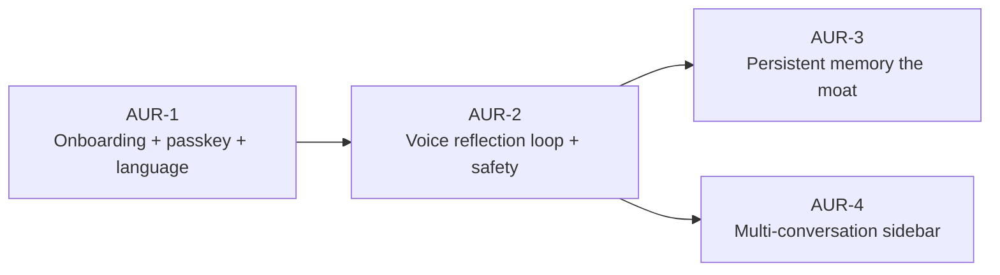

# MVP Bet Portfolio — Aura

> The initial bet wedge — what we build together so one real user can complete the core value loop once. Bootstrap-only: created once per project, after foundation product + architecture are approved.

## MVP definition

> _Verbatim user answer to the forcing question:_ **"What does this product need to do for one real user to complete the core value loop once?"**

**"A user can ask a question and get back a reasoned answer with citations in their local language, without breaking the bank."**

**PM clarification (logged 2026-05-24, see DRI):** "answer with citations" is shorthand for **reflective counsel with transparent reasoning** — Aura still asks the user back rather than dispensing advice or pointing to footnotes. Approved [product bet v2](./product.md) remains the source of truth; no amendment. The "without breaking the bank" clause reaffirms the architectural Cost fitness function (≤₹20/WAR/mo) at the portfolio level.

## MVP bets

Each bet is independently shippable in sequence per the dependency graph. Stubs live at `docs/bets/<bet-id>/brief.md` with `portfolio_stub: true` until promoted via `/create-brief <bet-id>`.

| Bet ID | Title | One-line hypothesis | Type | Depends on | Parallel with |
|--------|-------|---------------------|------|------------|---------------|
| **AUR-1** | Onboarding — passkey enrollment + handle + language picker (en, hi) | If users can create an identity in <60s with passkey + handle and pick English or Hindi, they reach the first reflection session — traces to [product § Target users / personas](./product.md) + [product § Scope → In scope](./product.md) | feature | — | — (gates the others) |
| **AUR-2** | Core voice reflection loop + crisis safety (single Conversation, English + Hindi) | If a user can speak in their language and get back a reflective question via Sarvam AI ASR + AI Gateway + Sarvam AI TTS, with same-session crisis escalation, they complete a Reflection Session — traces to [product § North-star metric (definition of WAR)](./product.md) + [product § Guardrails (Safety)](./product.md). _Speech provider updated 2026-05-26 per architecture amendment — was Bhashini._ | feature | AUR-1 | — |
| **AUR-3** | Persistent memory layer (the moat) | If Aura remembers the user's story across sessions via pgvector, D30 retention reaches ≥25% — traces to [product § Defensibility / Moat (primary moat #1)](./product.md) + [product OKR Objective 1 KR2](./product.md) | feature | AUR-1, AUR-2 | AUR-4 |
| **AUR-4** | Multi-conversation sidebar (parallel topical threads with title + last_active_at) | If users can have multiple parallel reflection threads visible in a sidebar, they return to specific topics rather than thread-hopping in one conversation — traces to [architecture § Foundational Data Model § Conversation](./architecture.md) (persistent topical threads, per user direction 2026-05-24) | feature | AUR-1, AUR-2 | AUR-3 |

## Dependency graph

## Parallel-build candidates

Independent paths that can start in parallel after the portfolio is approved:

- **Stream 1 (sequential gates):** AUR-1 → AUR-2. AUR-1 must finish (passkey + handle exist) before AUR-2 has anyone to talk to. AUR-2 must finish (the loop works + safety lands) before AUR-3 or AUR-4 has anything to enrich.
- **Stream 2 (parallel after AUR-2):** AUR-3 and AUR-4 can build concurrently — different surfaces (server-side memory layer vs mobile sidebar UI), different layers, no shared code path beyond `packages/db` schema reads. Two engineers (or one engineer alternating sprints) can ship them in any order.

## Deliberately out of MVP

Captured here so we don't lose them, **but no stub briefs created**. These come back as `/create-brief <free-text>` after the MVP ships and learnings settle.

- **Ratings + clarity-score + NPS capture flows** — per user Q2 answer (verbatim). Defer Objective 1 KR3 (≥1,000 ratings) instrumentation; basic post-session prompt only at MVP. NPS measurement starts post-MVP once a real user base exists.
- **Public app-store submission (iOS + Android)** — TestFlight / Internal Track at MVP; public store launch post-MVP. EAS Update covers preview channels for the closed-test cohort.
- **Language ramp beyond English + Hindi** (Tamil, Telugu, Bengali, Marathi, Kannada) — per architecture decision 2026-05-24; ramp post-MVP, each language gated by per-language quality eval (R-SPEECH).
- **Cost/WAR telemetry dashboard** — per-turn cost logging at MVP via Sentry / Vercel Observability is enough to detect runaway costs; full dashboard with WAR cohort breakdowns ships post-MVP.
- **Marketing landing page** — currently a Next.js stub at `apps/web/app/(marketing)`; brand work + content post-MVP.
- **Admin / ops console** — currently a Next.js stub at `apps/web/app/(admin)`; internal tooling post-MVP.
- **Envelope-encrypted memory (Variant C from the 2026-05-24 memory-architecture discussion)** — preserved as a future architectural-initiative bet if Security pillar needs to move from `good` to `best`.
- **Ad-supported model + B2B/EAP partnerships** — explicitly out of scope in [product v2 § Out of Scope (never)](./product.md).

## PM rationale

The MVP loop demands four things to work end-to-end: a user must (a) **exist** with an identity that survives device-restart, (b) **speak and be heard reflectively** in their language without crisis content slipping through, (c) be **remembered** the next time they open the app, and (d) bring back **multiple distinct topics** over time. AUR-1 through AUR-4 map to those four requirements one-to-one.

Three deliberate scope calls:

1. **Crisis safety folds into AUR-2** rather than its own bet. Reflective counsel without crisis escalation is not shippable per product § Guardrails (Safety) — partial on either side is worse than nothing. The dependency is built into the bet boundary, not a comment.
2. **Multi-conversation lands in MVP**, not post-MVP. Real users carry parallel concerns (career, family, money). A single ever-growing thread would force context collapse and break the data-moat thesis. Per user direction 2026-05-24.
3. **Ratings / NPS defers**. The WAR target is reachable without polished instrumentation; basic post-session prompt is enough to capture intent at MVP. Pulled into post-MVP via the user's Q2 anti-scope answer.

The "why this wedge" answer future-me checks against when scope-creep pressure arrives: *we shipped the smallest thing where one Indian user, in Hindi, could speak about a real decision, be heard reflectively, be kept safe, be remembered, and come back to a different topic next week.* If a proposed addition doesn't tighten one of those five, it's post-MVP.

## Promotion log

_Populated as each stub gets promoted to a full brief via `/create-brief <bet-id>`._

| Bet ID | Promoted on | Status after promotion |
|--------|-------------|------------------------|
| AUR-1 | 2026-05-24 | `approved` (Vivek, 2026-05-24) |
| AUR-2 | 2026-05-27 | `approved` (Vivek, 2026-05-28) |
| AUR-3 | — | — |
| AUR-4 | — | — |

## DRI Log

### Decisions

- [2026-05-24] [PM] **Fold crisis safety (CrisisFlag + EscalationEvent flows) into AUR-2 rather than a separate bet.**
  - **Rationale (required):** Per product § Guardrails (Safety): ≥99% of crisis-flagged conversations must get same-session Tele-MANAS escalation. Shipping a reflective conversation loop without crisis detection is non-shippable; shipping crisis detection without the loop has nothing to flag. The two are a single shippable unit; making them one bet honours the "must-ship-together" constraint structurally rather than via a fragile cross-bet dependency comment.
  - **Area (required, tag):** product / safety / scope.
  - **Alternatives considered (required):** Separate AUR-S "Crisis safety" bet with `parallel_with: [AUR-2]` (rejected — invites a tempting "ship AUR-2 first, do safety in v1.1" path that violates the Guardrail).
  - **Reversibility:** medium — split is mechanical if scope grows too large under AUR-2; merging back is harder.

- [2026-05-24] [PM] **Include multi-conversation (AUR-4) in MVP, not post-MVP.**
  - **Rationale (required):** Real Indian users carry multiple parallel concerns (career, family, money, health). A single growing thread would force context collapse — every new topic dilutes the memory recall for prior topics, and the data-moat thesis weakens. Per user direction 2026-05-24 after the Claude-sidebar screenshot prompted the realisation. The architecture decision (Conversation as persistent topical thread with title + last_active_at) already encodes the data shape; AUR-4 is the UI + behaviour bet that makes it usable.
  - **Area (required, tag):** product / scope.
  - **Alternatives considered (required):** Defer AUR-4 to post-MVP (rejected — first-100-user feedback would be biased by an unnatural single-thread experience; we'd learn the wrong things). Treat it as a smaller sub-story under AUR-2 (rejected — sidebar UX has its own design surface area that warrants a brief).
  - **Reversibility:** medium — pulling AUR-4 back to post-MVP is possible if the bet runs long, but the data shape would still ship in AUR-2 (columns exist regardless).

- [2026-05-24] [PM] **Bridge user's Q1 verbatim to approved product v2 framing via clarification gloss in this portfolio, not a product-bet amendment.**
  - **Rationale (required):** User confirmed (via Q1-interpretation question) that "reasoned answer with citations" was shorthand for reflective counsel with transparent reasoning, not a Perplexity-shape pivot. Approved product v2 remains the source of truth. The gloss in § MVP definition above makes the bridge visible to future readers so the verbatim doesn't drift in interpretation.
  - **Area (required, tag):** process / scope.
  - **Alternatives considered (required):** Amend product to v3 (rejected — user explicitly said no pivot); reword the verbatim (rejected — workflow requires verbatim user answer preserved).
  - **Reversibility:** easy — if the user later does pivot, that's a fresh `/setup-product` amendment.

- [2026-05-24] [Researcher] **No exact prior-art for vernacular voice-first AI counsel with persistent memory at the MVP scale Aura is targeting.** Closest analogues (Wysa, Replika, Tele-MANAS, Astrotalk) each ship a subset of what Aura needs — none ship the combination of (voice + vernacular + memory + reflective-counsel + free + safety-gated).
  - **Rationale (required):** Researcher review during portfolio drafting (research basis carries over from [`research.md`](./research.md) §F4). Implication for execution: **AUR-2 carries the most novel composition risk** because it's where four uncommon pieces converge (Sarvam AI speech in conversational context — _post-2026-05-26 amendment, was Bhashini_; AI Gateway routing tuned for Indian-language reflection; persistent memory recall in turn loop; crisis classifier in vernacular). Recommend sequencing AUR-2 as the second bet (after AUR-1 onboarding) and treating its first internal test as the riskiest milestone, not its eventual release.
  - **Area (required, tag):** research / sequencing.
  - **Alternatives considered (required):** Recommend AUR-1 + AUR-3 in parallel before AUR-2 (rejected — AUR-3 has nothing to remember without AUR-2 producing turns).
  - **Reversibility:** easy — execution sequencing is a `/create-brief` decision, not locked here.

### Risks

- [2026-05-24] [Researcher] **R-PORTFOLIO-1: Speech provider conversational-quality assumption not empirically validated for our v1 launch languages (English + Hindi).** Architecture's R-SPEECH risk re-surfaces at portfolio level so AUR-2's brief promotion inherits it explicitly. _Amended 2026-05-26: subject of the risk pivots from Bhashini to Sarvam AI per the architecture SUPERSEDES decision (see `docs/foundation/architecture.md` § DRI Decisions 2026-05-26). The proactive provider swap addresses the Bhashini-platform-reliability concern; the empirical-quality risk remains and must still be validated under AUR-2._
  - **Likelihood (required):** medium for Hindi (Sarvam is built by AI4Bharat alumni — well-aligned with our user audio profile, but not empirically tested by us at production volume); low for English (multiple credible options — Sarvam, OpenAI Whisper, native iOS/Android speech).
  - **Impact (required):** high — voice is the primary UX; failure mode is "users speak, Aura mis-hears, conversation breaks down" which kills the WAR metric directly.
  - **Mitigation (required):** Pre-MVP quality eval as a first task under AUR-2 — record 50–100 reflection-style conversations in Hindi + 50 in English, score MOS + WER in-house against Sarvam. If Hindi fails the bar, escalate to architecture v3 amendment (next provider candidates: OpenAI Realtime API + ElevenLabs, accepting the DPDPA-residency hit; or self-host AI4Bharat OSS as primary, accepting the Op-ex hit). For English, run the same eval against Whisper and native speech APIs; pick best quality-cost trade with DPDPA preserved (Sarvam wins if quality is close). Per architecture R-SPEECH + R-SPEECH-2.
  - **Area (required, tag):** research / AI / risk-carryover.

- [2026-05-24] [PM] **R-PORTFOLIO-2: 4-bet scope assumes the team can sequence AUR-1 → AUR-2 → (AUR-3 ∥ AUR-4) within a runway consistent with the product bet's 12-month north-star window** (100K WAR by month 12, D30 ≥ 25%, clarity score ≥ 4.0). At solo-to-3 team size and 1-week sprints, this means each bet ships in ≤ 4 sprints on average. Bhashini quality work (R-PORTFOLIO-1) could blow that budget on AUR-2.
  - **Likelihood (required):** medium (each individual bet looks tractable; cumulative risk is real).
  - **Impact (required):** medium-high (runway extension implies more funding burn per product v2 R6).
  - **Mitigation (required):** Treat each `/create-brief` as a checkpoint — if AUR-2's brief lands with a credible <6-sprint plan and AUR-1 ships on time, the rest follows. If AUR-2 expands to >8 sprints under R-PORTFOLIO-1 pressure (speech-provider quality work — Sarvam, post 2026-05-26 amendment), return to portfolio for amendment (could split safety out, could narrow voice to ASR-only with text response as v1 fallback).
  - **Area (required, tag):** product / sequencing / runway.

- [2026-05-24] [PM] **R-PORTFOLIO-3: Anti-engagement stance (per founder framing 2026-05-24 — "Cursor for users, hoping they don't use as much") is not reflected in product v2 metrics.** Product v2 § Defensibility lists "DAU/MAU ratio (proxy for habituation)" as a moat proxy metric — an engagement-maximization metric that contradicts the founder's stated stance that Aura succeeds when a user reaches clarity and *steps away* (the inverse of Replika / Character.AI / TikTok). The vision is "hear themselves clearly," which is a closure outcome, not a stickiness outcome. As feature bets ship, the absence of a guarding metric risks design defaults that quietly optimize for stickiness (notifications, streaks, depth-of-session pursuit).
  - **Likelihood (required):** high (the tension exists today in the approved product bet's metric list; it will compound silently as features ship if not surfaced).
  - **Impact (required):** medium (does not block MVP; risks the first feature bet — most likely AUR-2 — being designed against engagement-maximization defaults like DAU/MAU rather than closure-friendly metrics like time-to-clarity-moment).
  - **Mitigation (required):** (1) revisit product v2 metrics for a v3 amendment **after first-cohort data** validates whether the anti-engagement stance can be operationalized (vs. just rhetorical); (2) raise the question explicitly when `/create-brief AUR-2` runs so the brief promotion considers closure-friendly design choices; (3) do not adopt DAU/MAU as a tracked *target* metric in any analytics work or dashboards, even though product v2 lists it as a moat proxy — instrument it as a watch-metric only and flag if it climbs.
  - **Area (required, tag):** product / metrics / strategy.

### Issues
_None at portfolio-creation stage. Open issues from upstream artifacts (architecture P1s, product R6 funding plan) remain tracked in their own DRI logs._

---

_Approved by: Vivek on 2026-05-24._
